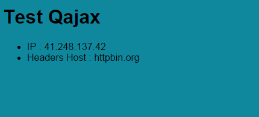

# formationMaroc-FrontPromises
Simple Qajax test with React with :
[https://github.com/gre/qajax](https://github.com/gre/qajax "https://github.com/gre/qajax")

Test JSON with : http://httpbin.org/

# TODO
- Use Q lib : [https://github.com/kriskowal/q](https://github.com/kriskowal/q "https://github.com/kriskowal/q")
- Add other json data and display it in the react component with JSON exemple from [http://httpbin.org/delay/3](http://httpbin.org/delay/3 "http://httpbin.org/delay/3"). Don't forget to update the api.js !
- See the asynchronous logs ...
- HTML Result must be :



# react version
```
0.14.0
```

# install
```
npm install
```

# dependencies
```
"dependencies": {
    "abyssa": "7.0.1",
    "fluxx": "0.4.0",
    "lodash": "3.9.1",
    "moment": "2.10.6",
    "normalize-css": "2.3.1",
    "numeral": "1.5.3",
    "q": "1.4.0",
    "qajax": "1.3.0",
    "react": "0.14.0",
    "react-dom": "0.14.0"
  }
```

# build
Stylus :
```
npm run build-stylus
```

JS :
```
npm run build-js
```

# watch
Stylus :
```
npm run watch-stylus
```

JS :
```
npm run watch-js
```

